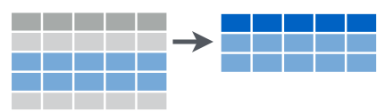
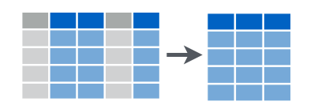
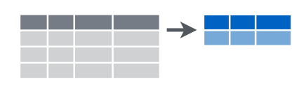
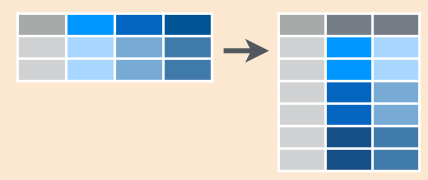
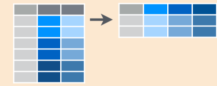
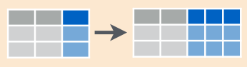
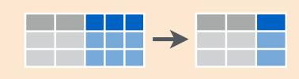

<style>
.title-slide {
  background-color: #10103F; /* #EDE0CF; ; #CA9F9D*/
}

.title-slide hgroup > h1{
 font-family: 'Oswald', 'Helvetica', sanserif; 
}

.title-slide hgroup > h1, 
.title-slide hgroup > h2 {
  color: #76DFC0;}

.title-slide hgroup > h1, 
.title-slide hgroup > h2 {
  color: #76DFC0;}


/* Fonts and Spacing */
article p, article li, article li.build, section p, section li{
  font-family: 'Open Sans','Helvetica', 'Crimson Text', 'Garamond',  'Palatino', sans-serif;
  text-align: justify;
  font-size:22px;
  line-height: 1.5em;
  color: #444;
}

/* Code Font */
code {
  font-size: 80%;
  font-family: "Source Code Pro", monospace;
  color: darkred;
}

</style>

## Data Science Process


There are few fundamental processes to turn data into understanding, knowledge & insight:
<div style="line-height:80%;">
    <br>
</div>


<div class="centered">Data manipulation</div>

<div style="line-height:80%;">
    <br>
</div>


<!-- Center image on slide -->
<script type="text/javascript" src="http://ajax.aspnetcdn.com/ajax/jQuery/jquery-1.7.min.js"></script>
<script type="text/javascript">
$(function() {     
  $("p:has(img)").addClass('centered'); 
});
</script>


<div class="centered">Data visualization</div> 

<div style="line-height:80%;">
    <br>
</div>


<div class="centered">Statistical analysis/modeling</div>

<div style="line-height:80%;">
    <br>
</div>


<div class="centered">Deployment of results</div>

--- .segue  bg:#10103F


<div class="centered">
<div style="color:#EF2F4F"> <b>80%</b> of data analysis is spent on: <b>CLEANING</b> and <b>PREPARING</b> data.
</div></div>


<br></br>
<div class="centered">
<div style="color:#EF2F4F"> And it must be <b>repeated</b> many times over the course of analysis.
</div></div>

--- 

<div style="color:#76DFC0">
<div class="centered">
We are going to focus on: </div></div>

<br></br>
<br></br>

<div class="centered">
  <div style="color:#EF2F4F"><b>Data Manipulation</b> (Reshaping & Wrangling)</div>
</div>

<br></br>

<div class="centered"><div style="color:#76DFC0"> + </div></div>

<br></br>

<div class="centered"> <div style="color:#EF2F4F"> <b> Data Visualization</b></div></div>

---- .segue bg:#76DFC0

<br></br>
<br></br>
<div class="centered"><div style="color:#EF2F4F">Let's start with some <b>DATA WRANGLING!!</b></div></div>
<br></br>
<div class="centered"><div style="color:#10103F">We will be using the package called <b>dplyr</b></div></div>


--- .segue .dark

<!-- DATA WRANGLING ---------------------------------------------------------->

## Data Wrangling with dplyr

---


## Syntax

- <b><span class = 'red'>tbl_df()</span></b>: converts data to tbl class. 
tbl’s are easier to examine than data frames. R displays only the data that fits onscreen.

- <b><span class = 'red'>glimpse()</span></b>: information dense summary of tbl data.


---- .segue bg:DarkSlateGray

## Example
<!-- First Example to show tbl_df and glimpse -->

---

The following dataset contains all 336776 flights that **departed from New York City in 2013**. The data comes from the US Bureau of Transportation Statistics

**Variables**:

- year, month, day - Date of departure

- dep_time, arr_time - Departure and arrival times, local tz.

- dep_delay, arr_delay - Departure and arrival delays, in minutes. Negative times represent early departures/arrivals.

- hour, minute - Time of departure broken in to hour and minutes

- carrier - Two letter carrier abbreviation

- tailnum - Plane tail number

- flight - Flight number

- origin, dest - Origin and destination

- air_time - Amount of time spent in the air

- distance - Distance flown


--- 

<style>
/* Code Font */
code {
  font-size: 80%;
  font-family: "Source Code Pro", monospace;
  color: darkred;
}

</style>

```{r, echo=TRUE}
flights <- tbl_df(read.csv("flights.csv", stringsAsFactors = FALSE))

flights
```

---


```{r, echo=TRUE}
glimpse(flights)
```

---

## Subset Observations (Rows)
<!-- PART II of DPLYR -------------------------------------------------------->


- <b><span class = 'red'> filter()</span></b>: extract rows that meet logical criteria.
- <b><span class = 'red'> distinct()</span></b>: remove duplicate rows.
- <b><span class = 'red'> sample_frac()</span></b>: randomly select fraction of rows.
- <b><span class = 'red'> sample_n()</span></b>: randomly select n rows.
- <b><span class = 'red'> slice()</span></b>: select rows by position.
- <b><span class = 'red'> top_n()</span></b>: select and order top n entries (by group if grouped data).

--- .segue bg:DarkSlateGray

## Example

---

Filter only fligths from United Airlines (UA)

```{r, echo=TRUE}
filter(flights, carrier == "UA")
```


---

<!-- PART III of DPLYR -------------------------------------------------------->

## Subset Variables (Columns)



- <b><span class = 'red'> select()</span></b>: select columns by name or helper function.

<br></br>

---

**There are several specials functions that ony work inside select:** 

```{r, echo=TRUE}
# How to get help
?dplyr::select #?select
```

--- .segue bg:DarkSlateGray

## Example

---

Select only columns that starts with ("d")

```{r, echo=TRUE}
select(flights, starts_with("d"))
```

---

<!-- PART IV of DPLYR -------------------------------------------------------->

## Summarize Data 



- <b><span class = 'red'>summarise(data, avg = mean(col_a))</span></b>: summarise data into single row of values.
- <b><span class = 'red'>summarise_each(data, funs(mean))</span></b>: apply summary function to each column.
- <b><span class = 'red'>count(data, vars_to_group_by, wt = col_a)</span></b>: count number of rows with each unique value of variable (with or without weights).

<br></br>

--- .segue bg:DarkSlateGray

## Example

---


Count the number of flights by carrier

```{r, echo=TRUE}
count(flights, carrier)
```

---
<!-- PART V of DPLYR ------------------------------------------------------------>

## Make New Variables


- <b><span class = 'red'>mutate(data, new_col = col_a + col_b)</span></b>: compute and append one or more new columns.
- <b><span class = 'red'>mutate_each(data, funs(min_rank))</span></b>: apply window function to each column.
- <b><span class = 'red'>transmute(data, new_col = col_a + col_b)</span></b>: compute one or more new columns. Drop original columns.
<br></br>


--- .segue bg:DarkSlateGray


## Example 

---

Create 2 new columns: gain and speed


```{r, echo=TRUE}
mutate(flights,
       gain = arr_delay - dep_delay,
       speed = distance / air_time * 60)
```

---

<!-- PART VI of DPLYR ------------------------------------------------------------>

## Group Data

- <b><span class = 'red'>group_by(data, col_to_be_grouped_by)</span></b>: group data into rows.
- <b><span class = 'red'>ungroup(data)</span></b>: remove grouping information from data frame. 

<br></br>


--- .segue bg:DarkSlateGray

## Example 

---

```{r, echo=TRUE}
group_by(flights, carrier)
```

---

<br></br>
<div class="centered"><div class="red2">
<b>What about if you want to to use more than one function?</b>
</div></div>
<br></br>

There are 3 ways to do this: 

1) use intermediate steps

2) use nested functions

3) **pipes**


---- .segue bg:Teal


## The %>% Operator - pipe operator

--- 

## 
It becomes more efficient and makes your code more legible:

```
data %>%
  filter(variable == "value") %>%
  summarize(Total = sum(variable)) %>%
  arrange(desc(Total))
```

It allows you to flow from data manipulation tasks straight into vizualization and also into many analytic functions:

```
data %>%
  filter(variable == "value") %>%
  summarize(Total = sum(variable)) %>%
  arrange(desc(Total)) %>% 
  ggplot()
```

--- .segue bg:DarkSlateGray

## Example 

---- .segue bg:DarkRed


### How can we get all flights departed on Feb 1st using %>%?


---

```{r, echo=TRUE}
flights %>% 
  filter(month == 2, day == 1)

```

---- .segue bg:DarkRed


### How can we get all flights that departure on January **OR** February?

---


```{r, echo=TRUE}
flights %>% 
  filter(month == 1 | month == 2)
```

---- .segue bg:DarkRed

### How can we order the flights by arrival delay?


---

```{r, echo=TRUE}
flights %>% 
  arrange(arr_delay)
```

---- 

### Another exercise:

1) split the dataset into individual carriers

2) summarize each plane by counting the number of flights

3) sort by the count 

---

```{r, echo=TRUE}
flights %>% 
  group_by(carrier) %>% 
  summarise(count = n()) %>% 
  arrange(count)
```

---

### Now compute for each carier:

1) the average distance

2) the average arrival delay 


---


```{r, echo=TRUE}
flights %>% 
  group_by(carrier) %>% 
  summarise(dist = mean(distance, na.rm = TRUE),
            delay = mean(arr_delay, na.rm = TRUE))

```

---- .segue bg:#76DFC0

<br></br>
<br></br>
<div class="centered"><div style="color:#EF2F4F">Now, the next part is: <b>DATA VISUALIZATION!!</b></div></div>
<br></br>
<div class="centered"><div style="color:#10103F">We will be using the package called <b>ggplot2</b></div></div>


--- .segue .dark


<!-- VISUALIZATION  ----------------------------------------------------------->

## Data Visualization with ggplot2

---

- It is a plotting package that makes it simple to create complex plots.

- The graphics are build **step by step** by **adding** new elements.


--- 


## To build a ggplot we need to:


1) bind the plot to a specific data frame using the `data` argument

```{r eval=FALSE}
ggplot(data = flights)
```

2) define aesthetics (`aes`), that maps variables in the data to axes on the plot
     or to plotting size, shape color, etc.,

```{r eval=FALSE}
ggplot(data = flights, aes(x = dep_delay, y = arr_delay))
```

---


3) add `geoms` 
 
 - graphical representation of the data in the plot (points,
     lines, bars). 
     

To add a geom to the plot use `+` operator:


```{r eval=FALSE}
ggplot(data = flights, aes(x = dep_delay, y = arr_delay)) +
  geom_point()
```

---


## Modifying plots

- adding transparency (alpha)

```{r eval=FALSE}
ggplot(data = flights, aes(x = dep_delay, y = arr_delay)) +
  geom_point(alpha = 0.1, na.rm = TRUE)
```


---

- adding colors

```{r eval=FALSE}
ggplot(data = flights, aes(x = dep_delay, y = arr_delay)) +
  geom_point(alpha = 0.1, color = "blue", na.rm = TRUE)
```


---


## Boxplot

Visualising the distribution of dep_delay by each carrier.

```{r eval=FALSE}
ggplot(data = flights, aes(x = carrier, y = dep_delay)) + 
  geom_boxplot(na.rm = TRUE)
```


---

  
```{r eval=FALSE}
new <- flights %>%
group_by(carrier, origin) %>%
summarize(delay = mean(arr_delay, na.rm = TRUE)) 

ggplot(data = new, aes( x = carrier, y = delay, fill = origin)) +
  geom_bar(stat = "identity", position = "dodge")
```

---

To get a bar graph of counts, don’t map a variable to y, and use stat="bin" (which is the default) instead of stat="identity":

```{r eval=FALSE}
# Bar graph of counts
ggplot(data = flights, aes(x = carrier)) +
    geom_bar(stat = "bin") # this argument is the default
```

---

## Faceting

It  allows to split one plot into multiple plots based on some factor. 

```{r eval=FALSE}
ggplot(data = new, aes( x = origin, y = delay)) +
  geom_bar(stat = "identity", position = "dodge") +
  facet_wrap(~carrier)
```

---

## Changing the Theme

```{r eval=FALSE} 
ggplot(data = new, aes( x = origin, y = delay)) +
  geom_bar(stat = "identity", position = "dodge") +
  facet_wrap(~carrier) + 
  theme_bw()
```

--- .segue .dark

<!-- DATA WRANGLING ---------------------------------------------------------->

## Data Reshaping with tidyr

---


<!-- DATA RESHAPING  ----------------------------------------------------------->

## Data Reshaping


<br></br>
<div class="centered"><div class="red2">
<b>tidyr</b> is a package that makes it easy to "tidy" your data. 
</div></div>
<br></br>

In **tidy** data:

1) Each variable forms a column.

2) Each observation forms a row.

3) Each type of observational unit forms a table.

---

**Tidy data** is data that’s easy to work with: 

- it’s easy to munge (with dplyr), 

- visualise (with ggplot2 or ggvis) and 

- model (with R’s hundreds of modelling packages). 
<br></br>
<br></br>
<br></br>
<br></br>
<br></br>
<br></br>

#### * If you want to know more: [http://vita.had.co.nz/papers/tidy-data.html](http://vita.had.co.nz/papers/tidy-data.html)


---- .segue .dark


## tidyr - Function


---

<!-- Limit image width and height -->
<style type="text/css">
img {     
  max-height: 100px;     
  max-width: 500px; 
}
</style>
 
<!-- Center image on slide -->
<script type="text/javascript" src="http://ajax.aspnetcdn.com/ajax/jQuery/jquery-1.7.min.js"></script>
<script type="text/javascript">
$(function() {     
  $("p:has(img)").addClass('centered'); 
});
</script>

- <b><span class = 'red'> gather()</span></b>: takes multiple columns, and gathers them into key-value pairs 
<div class="centered"><div class="blue">
gather columns into rows
</div></div>



- <b><span class = 'red'>spread()</span></b>: takes 2 columns (key & value) and spreads in to multiple columns
<div class="centered"><div class="blue">
spread rows into columns
</div></div>




---- .segue


- <b><span class = 'red'> separate()</span></b>: splits a single column into multiple columns
<div class="centered"><div class="blue">
separate one column into several
</div></div>


<div style='text-align: center;'>
    
</div>


- <b><span class = 'red'>unite()</span></b>: combines multiple columns into a single column
<div class="centered"><div class="blue">
unite several columns into one.
</div></div>




--- .segue bg:DarkSlateGray


## Example using tidyr


---

We'll use the **pew.csv** dataset. This dataset explores the relationship between **income** and **religion** in the US.


```{r, echo=TRUE}
# Load the packages
library(tidyr)
# Read the file
pew <- read.csv("pew.csv", 
               stringsAsFactors = FALSE, 
               check.names = FALSE)

head(pew, 5) #This data set has 3 variables: religion, income and frequency
```

---

## Let's tidy it! 


We need to **gather** the non-variable columns into a **2-column key-value pair**.

When gathering variables, we **need to provide** the name of the new key-value columns to create. 

<span style='color:red'>First argument:</span> name of the <b>key column</b>, i.e., the name of the variable defined by the values of the column headings.

<span style='color:red'>Second argument:</span> name of the <b>value column</b>, frequency. 

<span style='color:red'>Third argument:</span> defines the <b>columns to gather</b>.

---


```{r, echo=TRUE}
names(pew)
```

First argument? 
> - <span class = 'red'>key = income</span>

Second argument? 

> - <span class = 'red'>value = frequency</span>

Third argument? 
> - <span class = 'red'>-religion</span> (every column except religion)

---

```{r, echo=TRUE}
pew_tidy <- gather(data = pew, 
                   key = income, 
                   value = frequency,
                   -religion)

head(pew_tidy, 3)
```

This form is tidy because each column represents a variable and each row represents an observation, in this case a demographic unit corresponding to a combination of religion and income.


--- .segue bg:Teal

<b><span class = 'red'>I would like to thanks:</b></span>

### - Open Data Science

### - Hadley Wickham

### - Jennifer Bryan (and STAT 545)

### - Software Carpentry

### - Bradley Boehmke

### - Ted Hart

### - Nicole White

### - Mikhail Popov


--- 

## References

| **Good Links**  | 
|-----------------|
|   | 
| http://www.rdocumentation.org/ | 
| https://cran.r-project.org/   | 
| https://www.rstudio.com/resources/cheatsheets/ | 
| http://stat545-ubc.github.io/    | 
| http://usepa.github.io/introR/     | 
| http://stackoverflow.com/questions/tagged/r     | 
| http://slidify.org/| 

--- .segue bg:DarkSlateGray


## THANK YOU!
