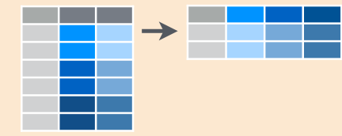

<style>
.title-slide {
  background-color: #10103F; /* #EDE0CF; ; #CA9F9D*/
}

.title-slide hgroup > h1{
 font-family: 'Oswald', 'Helvetica', sanserif; 
}

.title-slide hgroup > h1, 
.title-slide hgroup > h2 {
  color: #76DFC0;}

.title-slide hgroup > h1, 
.title-slide hgroup > h2 {
  color: #76DFC0;}


/* Fonts and Spacing */
article p, article li, article li.build, section p, section li{
  font-family: 'Open Sans','Helvetica', 'Crimson Text', 'Garamond',  'Palatino', sans-serif;
  text-align: justify;
  font-size:22px;
  line-height: 1.5em;
  color: #444;
}

/* Code Font */
code {
  font-size: 80%;
  font-family: "Source Code Pro", monospace;
  color: darkred;
}

</style>

## Data Science Process


There are few fundamental processes to turn data into understanding, knowledge & insight:
<div style="line-height:80%;">
    <br>
</div>


<div class="centered">Data manipulation</div>

<div style="line-height:80%;">
    <br>
</div>


<!-- Center image on slide -->
<script type="text/javascript" src="http://ajax.aspnetcdn.com/ajax/jQuery/jquery-1.7.min.js"></script>
<script type="text/javascript">
$(function() {     
  $("p:has(img)").addClass('centered'); 
});
</script>


<div class="centered">Data visualization</div> 

<div style="line-height:80%;">
    <br>
</div>


<div class="centered">Statistical analysis/modeling</div>

<div style="line-height:80%;">
    <br>
</div>


<div class="centered">Deployment of results</div>

--- .segue  bg:#10103F


<div class="centered">
<div style="color:#EF2F4F"> <b>80%</b> of data analysis is spent on: <b>CLEANING</b> and <b>PREPARING</b> data.
</div></div>


<br></br>
<div class="centered">
<div style="color:#EF2F4F"> And it must be <b>repeated</b> many times over the course of analysis.
</div></div>

--- 

<div style="color:#76DFC0">
<div class="centered">
We are going to focus on: </div></div>

<br></br>
<br></br>

<div class="centered">
  <div style="color:#EF2F4F"><b>Data Manipulation</b> (Reshaping & Wrangling)</div>
</div>

<br></br>

<div class="centered"><div style="color:#76DFC0"> + </div></div>

<br></br>

<div class="centered"> <div style="color:#EF2F4F"> <b> Data Visualization</b></div></div>

---- .segue bg:#76DFC0

<br></br>
<br></br>
<div class="centered"><div style="color:#EF2F4F">Let's start with some <b>DATA WRANGLING!!</b></div></div>
<br></br>
<div class="centered"><div style="color:#10103F">We will be using the package called <b>dplyr</b></div></div>


--- .segue .dark

<!-- DATA WRANGLING ---------------------------------------------------------->

## Data Wrangling with dplyr

---


## Syntax

- <b><span class = 'red'>tbl_df()</span></b>: converts data to tbl class. 
tbl’s are easier to examine than data frames. R displays only the data that fits onscreen.

- <b><span class = 'red'>glimpse()</span></b>: information dense summary of tbl data.


---- .segue bg:DarkSlateGray

## Example
<!-- First Example to show tbl_df and glimpse -->

---

The following dataset contains all 336776 flights that **departed from New York City in 2013**. The data comes from the US Bureau of Transportation Statistics

**Variables**:

- year, month, day - Date of departure

- dep_time, arr_time - Departure and arrival times, local tz.

- dep_delay, arr_delay - Departure and arrival delays, in minutes. Negative times represent early departures/arrivals.

- hour, minute - Time of departure broken in to hour and minutes

- carrier - Two letter carrier abbreviation

- tailnum - Plane tail number

- flight - Flight number

- origin, dest - Origin and destination

- air_time - Amount of time spent in the air

- distance - Distance flown


--- 

<style>
/* Code Font */
code {
  font-size: 80%;
  font-family: "Source Code Pro", monospace;
  color: darkred;
}

</style>


```r
flights <- tbl_df(read.csv("flights.csv", stringsAsFactors = FALSE))

flights
```

```
## Source: local data frame [336,776 x 16]
## 
##     year month   day dep_time dep_delay arr_time arr_delay carrier tailnum
##    (int) (int) (int)    (int)     (int)    (int)     (int)   (chr)   (chr)
## 1   2013     1     1      517         2      830        11      UA  N14228
## 2   2013     1     1      533         4      850        20      UA  N24211
## 3   2013     1     1      542         2      923        33      AA  N619AA
## 4   2013     1     1      544        -1     1004       -18      B6  N804JB
## 5   2013     1     1      554        -6      812       -25      DL  N668DN
## 6   2013     1     1      554        -4      740        12      UA  N39463
## 7   2013     1     1      555        -5      913        19      B6  N516JB
## 8   2013     1     1      557        -3      709       -14      EV  N829AS
## 9   2013     1     1      557        -3      838        -8      B6  N593JB
## 10  2013     1     1      558        -2      753         8      AA  N3ALAA
## ..   ...   ...   ...      ...       ...      ...       ...     ...     ...
## Variables not shown: flight (int), origin (chr), dest (chr), air_time
##   (int), distance (int), hour (int), minute (int)
```

---


```r
glimpse(flights)
```

```
## Observations: 336,776
## Variables: 16
## $ year      (int) 2013, 2013, 2013, 2013, 2013, 2013, 2013, 2013, 2013...
## $ month     (int) 1, 1, 1, 1, 1, 1, 1, 1, 1, 1, 1, 1, 1, 1, 1, 1, 1, 1...
## $ day       (int) 1, 1, 1, 1, 1, 1, 1, 1, 1, 1, 1, 1, 1, 1, 1, 1, 1, 1...
## $ dep_time  (int) 517, 533, 542, 544, 554, 554, 555, 557, 557, 558, 55...
## $ dep_delay (int) 2, 4, 2, -1, -6, -4, -5, -3, -3, -2, -2, -2, -2, -2,...
## $ arr_time  (int) 830, 850, 923, 1004, 812, 740, 913, 709, 838, 753, 8...
## $ arr_delay (int) 11, 20, 33, -18, -25, 12, 19, -14, -8, 8, -2, -3, 7,...
## $ carrier   (chr) "UA", "UA", "AA", "B6", "DL", "UA", "B6", "EV", "B6"...
## $ tailnum   (chr) "N14228", "N24211", "N619AA", "N804JB", "N668DN", "N...
## $ flight    (int) 1545, 1714, 1141, 725, 461, 1696, 507, 5708, 79, 301...
## $ origin    (chr) "EWR", "LGA", "JFK", "JFK", "LGA", "EWR", "EWR", "LG...
## $ dest      (chr) "IAH", "IAH", "MIA", "BQN", "ATL", "ORD", "FLL", "IA...
## $ air_time  (int) 227, 227, 160, 183, 116, 150, 158, 53, 140, 138, 149...
## $ distance  (int) 1400, 1416, 1089, 1576, 762, 719, 1065, 229, 944, 73...
## $ hour      (int) 5, 5, 5, 5, 5, 5, 5, 5, 5, 5, 5, 5, 5, 5, 5, 5, 5, 6...
## $ minute    (int) 17, 33, 42, 44, 54, 54, 55, 57, 57, 58, 58, 58, 58, ...
```

---

## Subset Observations (Rows)
<!-- PART II of DPLYR -------------------------------------------------------->


- <b><span class = 'red'> filter()</span></b>: extract rows that meet logical criteria.
- <b><span class = 'red'> distinct()</span></b>: remove duplicate rows.
- <b><span class = 'red'> sample_frac()</span></b>: randomly select fraction of rows.
- <b><span class = 'red'> sample_n()</span></b>: randomly select n rows.
- <b><span class = 'red'> slice()</span></b>: select rows by position.
- <b><span class = 'red'> top_n()</span></b>: select and order top n entries (by group if grouped data).

--- .segue bg:DarkSlateGray

## Example

---

Filter only fligths from United Airlines (UA)


```r
filter(flights, carrier == "UA")
```

```
## Source: local data frame [58,665 x 16]
## 
##     year month   day dep_time dep_delay arr_time arr_delay carrier tailnum
##    (int) (int) (int)    (int)     (int)    (int)     (int)   (chr)   (chr)
## 1   2013     1     1      517         2      830        11      UA  N14228
## 2   2013     1     1      533         4      850        20      UA  N24211
## 3   2013     1     1      554        -4      740        12      UA  N39463
## 4   2013     1     1      558        -2      924         7      UA  N29129
## 5   2013     1     1      558        -2      923       -14      UA  N53441
## 6   2013     1     1      559        -1      854        -8      UA  N76515
## 7   2013     1     1      607         0      858       -17      UA  N53442
## 8   2013     1     1      611        11      945        14      UA  N532UA
## 9   2013     1     1      623        -4      933         1      UA  N459UA
## 10  2013     1     1      628        -2     1016        29      UA  N33289
## ..   ...   ...   ...      ...       ...      ...       ...     ...     ...
## Variables not shown: flight (int), origin (chr), dest (chr), air_time
##   (int), distance (int), hour (int), minute (int)
```


---

<!-- PART III of DPLYR -------------------------------------------------------->

## Subset Variables (Columns)


- <b><span class = 'red'> select()</span></b>: select columns by name or helper function.

<br></br>

---

**There are several specials functions that ony work inside select:** 


```r
# How to get help
?dplyr::select #?select
```

--- .segue bg:DarkSlateGray

## Example

---

Select only columns that starts with ("d")


```r
select(flights, starts_with("d"))
```

```
## Source: local data frame [336,776 x 5]
## 
##      day dep_time dep_delay  dest distance
##    (int)    (int)     (int) (chr)    (int)
## 1      1      517         2   IAH     1400
## 2      1      533         4   IAH     1416
## 3      1      542         2   MIA     1089
## 4      1      544        -1   BQN     1576
## 5      1      554        -6   ATL      762
## 6      1      554        -4   ORD      719
## 7      1      555        -5   FLL     1065
## 8      1      557        -3   IAD      229
## 9      1      557        -3   MCO      944
## 10     1      558        -2   ORD      733
## ..   ...      ...       ...   ...      ...
```

---

<!-- PART IV of DPLYR -------------------------------------------------------->

## Summarize Data 


- <b><span class = 'red'>summarise(data, avg = mean(col_a))</span></b>: summarise data into single row of values.
- <b><span class = 'red'>summarise_each(data, funs(mean))</span></b>: apply summary function to each column.
- <b><span class = 'red'>count(data, vars_to_group_by, wt = col_a)</span></b>: count number of rows with each unique value of variable (with or without weights).

<br></br>

--- .segue bg:DarkSlateGray

## Example

---


Count the number of flights by carrier


```r
count(flights, carrier)
```

```
## Source: local data frame [16 x 2]
## 
##    carrier     n
##      (chr) (int)
## 1       9E 18460
## 2       AA 32729
## 3       AS   714
## 4       B6 54635
## 5       DL 48110
## 6       EV 54173
## 7       F9   685
## 8       FL  3260
## 9       HA   342
## 10      MQ 26397
## 11      OO    32
## 12      UA 58665
## 13      US 20536
## 14      VX  5162
## 15      WN 12275
## 16      YV   601
```

---
<!-- PART V of DPLYR ------------------------------------------------------------>

## Make New Variables


- <b><span class = 'red'>mutate(data, new_col = col_a + col_b)</span></b>: compute and append one or more new columns.
- <b><span class = 'red'>mutate_each(data, funs(min_rank))</span></b>: apply window function to each column.
- <b><span class = 'red'>transmute(data, new_col = col_a + col_b)</span></b>: compute one or more new columns. Drop original columns.
<br></br>


--- .segue bg:DarkSlateGray


## Example 

---

Create 2 new columns: gain and speed


```r
mutate(flights,
       gain = arr_delay - dep_delay,
       speed = distance / air_time * 60)
```

```
## Source: local data frame [336,776 x 18]
## 
##     year month   day dep_time dep_delay arr_time arr_delay carrier tailnum
##    (int) (int) (int)    (int)     (int)    (int)     (int)   (chr)   (chr)
## 1   2013     1     1      517         2      830        11      UA  N14228
## 2   2013     1     1      533         4      850        20      UA  N24211
## 3   2013     1     1      542         2      923        33      AA  N619AA
## 4   2013     1     1      544        -1     1004       -18      B6  N804JB
## 5   2013     1     1      554        -6      812       -25      DL  N668DN
## 6   2013     1     1      554        -4      740        12      UA  N39463
## 7   2013     1     1      555        -5      913        19      B6  N516JB
## 8   2013     1     1      557        -3      709       -14      EV  N829AS
## 9   2013     1     1      557        -3      838        -8      B6  N593JB
## 10  2013     1     1      558        -2      753         8      AA  N3ALAA
## ..   ...   ...   ...      ...       ...      ...       ...     ...     ...
## Variables not shown: flight (int), origin (chr), dest (chr), air_time
##   (int), distance (int), hour (int), minute (int), gain (int), speed (dbl)
```

---

<!-- PART VI of DPLYR ------------------------------------------------------------>

## Group Data

- <b><span class = 'red'>group_by(data, col_to_be_grouped_by)</span></b>: group data into rows.
- <b><span class = 'red'>ungroup(data)</span></b>: remove grouping information from data frame. 

<br></br>


--- .segue bg:DarkSlateGray

## Example 

---


```r
group_by(flights, carrier)
```

```
## Source: local data frame [336,776 x 16]
## Groups: carrier [16]
## 
##     year month   day dep_time dep_delay arr_time arr_delay carrier tailnum
##    (int) (int) (int)    (int)     (int)    (int)     (int)   (chr)   (chr)
## 1   2013     1     1      517         2      830        11      UA  N14228
## 2   2013     1     1      533         4      850        20      UA  N24211
## 3   2013     1     1      542         2      923        33      AA  N619AA
## 4   2013     1     1      544        -1     1004       -18      B6  N804JB
## 5   2013     1     1      554        -6      812       -25      DL  N668DN
## 6   2013     1     1      554        -4      740        12      UA  N39463
## 7   2013     1     1      555        -5      913        19      B6  N516JB
## 8   2013     1     1      557        -3      709       -14      EV  N829AS
## 9   2013     1     1      557        -3      838        -8      B6  N593JB
## 10  2013     1     1      558        -2      753         8      AA  N3ALAA
## ..   ...   ...   ...      ...       ...      ...       ...     ...     ...
## Variables not shown: flight (int), origin (chr), dest (chr), air_time
##   (int), distance (int), hour (int), minute (int)
```

---

<br></br>
<div class="centered"><div class="red2">
<b>What about if you want to to use more than one function?</b>
</div></div>
<br></br>

There are 3 ways to do this: 

1) use intermediate steps

2) use nested functions

3) **pipes**


---- .segue bg:Teal


## The %>% Operator - pipe operator

--- 

## 
It becomes more efficient and makes your code more legible:

```
data %>%
  filter(variable == "value") %>%
  summarize(Total = sum(variable)) %>%
  arrange(desc(Total))
```

It allows you to flow from data manipulation tasks straight into vizualization and also into many analytic functions:

```
data %>%
  filter(variable == "value") %>%
  summarize(Total = sum(variable)) %>%
  arrange(desc(Total)) %>% 
  ggplot()
```

--- .segue bg:DarkSlateGray

## Example 

---- .segue bg:DarkRed


### How can we get all flights departed on Feb 1st using %>%?


---


```r
flights %>% 
  filter(month == 2, day == 1)
```

```
## Source: local data frame [926 x 16]
## 
##     year month   day dep_time dep_delay arr_time arr_delay carrier tailnum
##    (int) (int) (int)    (int)     (int)    (int)     (int)   (chr)   (chr)
## 1   2013     2     1      456        -4      652         4      US  N197UW
## 2   2013     2     1      520        -5      816        -4      UA  N24211
## 3   2013     2     1      527        -3      837         8      UA  N470UA
## 4   2013     2     1      532        -8     1007       -10      B6  N554JB
## 5   2013     2     1      540         0      859         9      AA  N615AA
## 6   2013     2     1      552        -8      714        -1      EV  N829AS
## 7   2013     2     1      552        -8      919         9      AA  N3BUAA
## 8   2013     2     1      552        -8      655       -14      B6  N346JB
## 9   2013     2     1      553        -7      833        18      FL  N980AT
## 10  2013     2     1      553        -7      821        -4      MQ  N1EAMQ
## ..   ...   ...   ...      ...       ...      ...       ...     ...     ...
## Variables not shown: flight (int), origin (chr), dest (chr), air_time
##   (int), distance (int), hour (int), minute (int)
```

---- .segue bg:DarkRed


### How can we get all flights that departure on January **OR** February?

---


```r
flights %>% 
  filter(month == 1 | month == 2)
```

```
## Source: local data frame [51,955 x 16]
## 
##     year month   day dep_time dep_delay arr_time arr_delay carrier tailnum
##    (int) (int) (int)    (int)     (int)    (int)     (int)   (chr)   (chr)
## 1   2013     1     1      517         2      830        11      UA  N14228
## 2   2013     1     1      533         4      850        20      UA  N24211
## 3   2013     1     1      542         2      923        33      AA  N619AA
## 4   2013     1     1      544        -1     1004       -18      B6  N804JB
## 5   2013     1     1      554        -6      812       -25      DL  N668DN
## 6   2013     1     1      554        -4      740        12      UA  N39463
## 7   2013     1     1      555        -5      913        19      B6  N516JB
## 8   2013     1     1      557        -3      709       -14      EV  N829AS
## 9   2013     1     1      557        -3      838        -8      B6  N593JB
## 10  2013     1     1      558        -2      753         8      AA  N3ALAA
## ..   ...   ...   ...      ...       ...      ...       ...     ...     ...
## Variables not shown: flight (int), origin (chr), dest (chr), air_time
##   (int), distance (int), hour (int), minute (int)
```

---- .segue bg:DarkRed

### How can we order the flights by arrival delay?


---


```r
flights %>% 
  arrange(arr_delay)
```

```
## Source: local data frame [336,776 x 16]
## 
##     year month   day dep_time dep_delay arr_time arr_delay carrier tailnum
##    (int) (int) (int)    (int)     (int)    (int)     (int)   (chr)   (chr)
## 1   2013     5     7     1715       -14     1944       -86      VX  N843VA
## 2   2013     5    20      719       -16      951       -79      VX  N840VA
## 3   2013     5     2     1947        -2     2209       -75      UA  N851UA
## 4   2013     5     6     1826        -4     2045       -75      AA  N3KCAA
## 5   2013     5     4     1816        -4     2017       -74      AS  N551AS
## 6   2013     5     2     1926        -3     2157       -73      UA  N24212
## 7   2013     5     6     1753        -2     2004       -71      DL  N3760C
## 8   2013     5     7     2054        -1     2317       -71      UA  N806UA
## 9   2013     5    13      657        -3      908       -71      B6  N805JB
## 10  2013     1     4     1026        -4     1305       -70      VX  N855VA
## ..   ...   ...   ...      ...       ...      ...       ...     ...     ...
## Variables not shown: flight (int), origin (chr), dest (chr), air_time
##   (int), distance (int), hour (int), minute (int)
```

---- 

### Another exercise:

1) split the dataset into individual carriers

2) summarize each plane by counting the number of flights

3) sort by the count 

---


```r
flights %>% 
  group_by(carrier) %>% 
  summarise(count = n()) %>% 
  arrange(count)
```

```
## Source: local data frame [16 x 2]
## 
##    carrier count
##      (chr) (int)
## 1       OO    32
## 2       HA   342
## 3       YV   601
## 4       F9   685
## 5       AS   714
## 6       FL  3260
## 7       VX  5162
## 8       WN 12275
## 9       9E 18460
## 10      US 20536
## 11      MQ 26397
## 12      AA 32729
## 13      DL 48110
## 14      EV 54173
## 15      B6 54635
## 16      UA 58665
```

---

### Now compute for each carier:

1) the average distance

2) the average arrival delay 


---


```r
flights %>% 
  group_by(carrier) %>% 
  summarise(dist = mean(distance, na.rm = TRUE),
            delay = mean(arr_delay, na.rm = TRUE))
```

```
## Source: local data frame [16 x 3]
## 
##    carrier      dist      delay
##      (chr)     (dbl)      (dbl)
## 1       9E  530.2358  7.3796692
## 2       AA 1340.2360  0.3642909
## 3       AS 2402.0000 -9.9308886
## 4       B6 1068.6215  9.4579733
## 5       DL 1236.9012  1.6443409
## 6       EV  562.9917 15.7964311
## 7       F9 1620.0000 21.9207048
## 8       FL  664.8294 20.1159055
## 9       HA 4983.0000 -6.9152047
## 10      MQ  569.5327 10.7747334
## 11      OO  500.8125 11.9310345
## 12      UA 1529.1149  3.5580111
## 13      US  553.4563  2.1295951
## 14      VX 2499.4822  1.7644644
## 15      WN  996.2691  9.6491199
## 16      YV  375.0333 15.5569853
```

---- .segue bg:#76DFC0

<br></br>
<br></br>
<div class="centered"><div style="color:#EF2F4F">Now, the next part is: <b>DATA VISUALIZATION!!</b></div></div>
<br></br>
<div class="centered"><div style="color:#10103F">We will be using the package called <b>ggplot2</b></div></div>


--- .segue .dark


<!-- VISUALIZATION  ----------------------------------------------------------->

## Data Visualization with ggplot2

---

- It is a plotting package that makes it simple to create complex plots.

- The graphics are build **step by step** by **adding** new elements.


--- 


## To build a ggplot we need to:


1) bind the plot to a specific data frame using the `data` argument


```r
ggplot(data = flights)
```

2) define aesthetics (`aes`), that maps variables in the data to axes on the plot
     or to plotting size, shape color, etc.,


```r
ggplot(data = flights, aes(x = dep_delay, y = arr_delay))
```

---


3) add `geoms` 
 
 - graphical representation of the data in the plot (points,
     lines, bars). 
     

To add a geom to the plot use `+` operator:


```r
ggplot(data = flights, aes(x = dep_delay, y = arr_delay)) +
  geom_point()
```

---


## Modifying plots

- adding transparency (alpha)


```r
ggplot(data = flights, aes(x = dep_delay, y = arr_delay)) +
  geom_point(alpha = 0.1, na.rm = TRUE)
```


---

- adding colors


```r
ggplot(data = flights, aes(x = dep_delay, y = arr_delay)) +
  geom_point(alpha = 0.1, color = "blue", na.rm = TRUE)
```


---


## Boxplot

Visualising the distribution of dep_delay by each carrier.


```r
ggplot(data = flights, aes(x = carrier, y = dep_delay)) + 
  geom_boxplot(na.rm = TRUE)
```


---

  

```r
new <- flights %>%
group_by(carrier, origin) %>%
summarize(delay = mean(arr_delay, na.rm = TRUE)) 

ggplot(data = new, aes( x = carrier, y = delay, fill = origin)) +
  geom_bar(stat = "identity", position = "dodge")
```

---

To get a bar graph of counts, don’t map a variable to y, and use stat="bin" (which is the default) instead of stat="identity":


```r
# Bar graph of counts
ggplot(data = flights, aes(x = carrier)) +
    geom_bar(stat = "bin") # this argument is the default
```

---

## Faceting

It  allows to split one plot into multiple plots based on some factor. 


```r
ggplot(data = new, aes( x = origin, y = delay)) +
  geom_bar(stat = "identity", position = "dodge") +
  facet_wrap(~carrier)
```

---

## Changing the Theme


```r
ggplot(data = new, aes( x = origin, y = delay)) +
  geom_bar(stat = "identity", position = "dodge") +
  facet_wrap(~carrier) + 
  theme_bw()
```

--- .segue .dark

<!-- DATA WRANGLING ---------------------------------------------------------->

## Data Reshaping with tidyr

---


<!-- DATA RESHAPING  ----------------------------------------------------------->

## Data Reshaping


<br></br>
<div class="centered"><div class="red2">
<b>tidyr</b> is a package that makes it easy to "tidy" your data. 
</div></div>
<br></br>

In **tidy** data:

1) Each variable forms a column.

2) Each observation forms a row.

3) Each type of observational unit forms a table.

---

**Tidy data** is data that’s easy to work with: 

- it’s easy to munge (with dplyr), 

- visualise (with ggplot2 or ggvis) and 

- model (with R’s hundreds of modelling packages). 
<br></br>
<br></br>
<br></br>
<br></br>
<br></br>
<br></br>

#### * If you want to know more: [http://vita.had.co.nz/papers/tidy-data.html](http://vita.had.co.nz/papers/tidy-data.html)


---- .segue .dark


## tidyr - Function


---

<!-- Limit image width and height -->
<style type="text/css">
img {     
  max-height: 100px;     
  max-width: 500px; 
}
</style>
 
<!-- Center image on slide -->
<script type="text/javascript" src="http://ajax.aspnetcdn.com/ajax/jQuery/jquery-1.7.min.js"></script>
<script type="text/javascript">
$(function() {     
  $("p:has(img)").addClass('centered'); 
});
</script>

- <b><span class = 'red'> gather()</span></b>: takes multiple columns, and gathers them into key-value pairs 
<div class="centered"><div class="blue">
gather columns into rows
</div></div>


- <b><span class = 'red'>spread()</span></b>: takes 2 columns (key & value) and spreads in to multiple columns
<div class="centered"><div class="blue">
spread rows into columns
</div></div>




---- .segue


- <b><span class = 'red'> separate()</span></b>: splits a single column into multiple columns
<div class="centered"><div class="blue">
separate one column into several
</div></div>


<div style='text-align: center;'>
    
</div>


- <b><span class = 'red'>unite()</span></b>: combines multiple columns into a single column
<div class="centered"><div class="blue">
unite several columns into one.
</div></div>


--- .segue bg:DarkSlateGray


## Example using tidyr


---

We'll use the **pew.csv** dataset. This dataset explores the relationship between **income** and **religion** in the US.


```r
# Load the packages
library(tidyr)
# Read the file
pew <- read.csv("pew.csv", 
               stringsAsFactors = FALSE, 
               check.names = FALSE)

head(pew, 5) #This data set has 3 variables: religion, income and frequency
```

```
##             religion <$10k $10-20k $20-30k $30-40k $40-50k $50-75k
## 1           Agnostic    27      34      60      81      76     137
## 2            Atheist    12      27      37      52      35      70
## 3           Buddhist    27      21      30      34      33      58
## 4           Catholic   418     617     732     670     638    1116
## 5 Don’t know/refused    15      14      15      11      10      35
##   $75-100k $100-150k >150k Don't know/refused
## 1      122       109    84                 96
## 2       73        59    74                 76
## 3       62        39    53                 54
## 4      949       792   633               1489
## 5       21        17    18                116
```

---

## Let's tidy it! 


We need to **gather** the non-variable columns into a **2-column key-value pair**.

When gathering variables, we **need to provide** the name of the new key-value columns to create. 

<span style='color:red'>First argument:</span> name of the <b>key column</b>, i.e., the name of the variable defined by the values of the column headings.

<span style='color:red'>Second argument:</span> name of the <b>value column</b>, frequency. 

<span style='color:red'>Third argument:</span> defines the <b>columns to gather</b>.

---


```r
names(pew)
```

```
##  [1] "religion"           "<$10k"              "$10-20k"           
##  [4] "$20-30k"            "$30-40k"            "$40-50k"           
##  [7] "$50-75k"            "$75-100k"           "$100-150k"         
## [10] ">150k"              "Don't know/refused"
```

First argument? 
> - <span class = 'red'>key = income</span>

Second argument? 

> - <span class = 'red'>value = frequency</span>

Third argument? 
> - <span class = 'red'>-religion</span> (every column except religion)

---


```r
pew_tidy <- gather(data = pew, 
                   key = income, 
                   value = frequency,
                   -religion)

head(pew_tidy, 3)
```

```
##   religion income frequency
## 1 Agnostic  <$10k        27
## 2  Atheist  <$10k        12
## 3 Buddhist  <$10k        27
```

This form is tidy because each column represents a variable and each row represents an observation, in this case a demographic unit corresponding to a combination of religion and income.


--- .segue bg:Teal

<b><span class = 'red'>I would like to thanks:</b></span>

### - Open Data Science

### - Hadley Wickham

### - Jennifer Bryan (and STAT 545)

### - Software Carpentry

### - Bradley Boehmke

### - Ted Hart

### - Nicole White

### - Mikhail Popov


--- 

## References

| **Good Links**  | 
|-----------------|
|   | 
| http://www.rdocumentation.org/ | 
| https://cran.r-project.org/   | 
| https://www.rstudio.com/resources/cheatsheets/ | 
| http://stat545-ubc.github.io/    | 
| http://usepa.github.io/introR/     | 
| http://stackoverflow.com/questions/tagged/r     | 
| http://slidify.org/| 

--- .segue bg:DarkSlateGray


## THANK YOU!


<div style='text-align: left;'>
    
</div>

<b><span class = 'red'>@gdequeiroz</b></span>

<br></br>
<b><span class = 'red'>Slides:</b> http://rpubs.com/gdequeiroz/ODSC</span>

